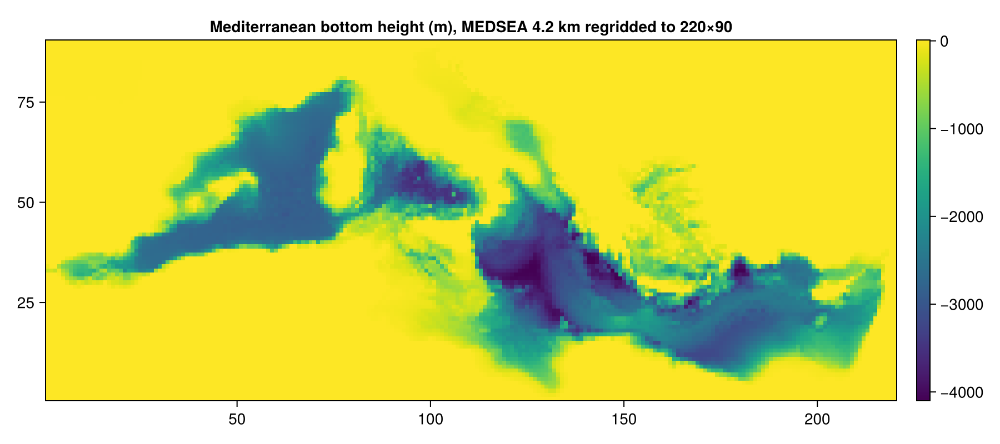
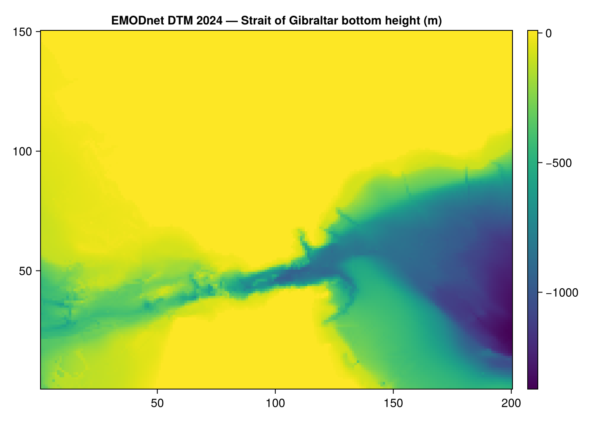
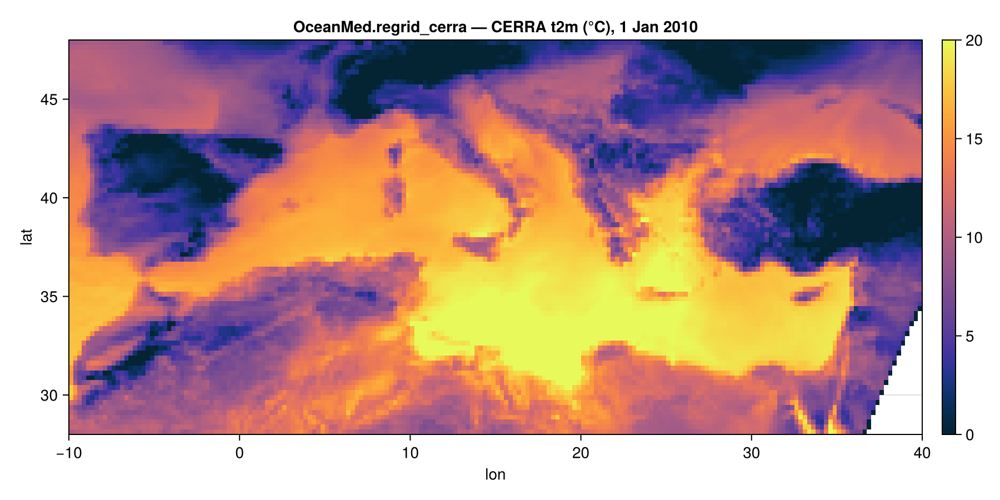

# OceanMed.jl

High-resolution Mediterranean Sea ocean simulations built on
[Oceananigans](https://github.com/CliMA/Oceananigans.jl) and
[NumericalEarth](https://github.com/CliMA/NumericalEarth.jl).

`OceanMed` is both a small reusable module (`src/`) and a set of runnable example scripts. The module
registers high-resolution Copernicus datasets as NumericalEarth datasets — the MEDSEA and EMODnet
bathymetries and the CERRA atmospheric reanalysis — and collects the building blocks shared across the
Mediterranean configurations: vertical-grid construction, the Strait of Gibraltar open boundary
conditions and sponge layers, and the conservative regridding of the CERRA forcing.



## What is in here

| File | Purpose |
| --- | --- |
| `src/OceanMed.jl` | Module entry point and exports. |
| `src/bathymetry_datasets.jl` | `MEDSEABathymetry` and `EMODnetBathymetry` — Mediterranean bathymetries registered as NumericalEarth datasets. |
| `src/vertical_grids.jl` | `copernicus_z_faces` — the stretched Copernicus vertical grid. |
| `src/open_boundary_conditions.jl` | Gibraltar open boundary conditions and sponge forcings. |
| `src/cerra_forcing.jl` | CERRA dataset, prescribed atmosphere & radiation on the native Lambert grid. |
| `src/regrid_cerra_state.jl` | Conservative regridding of the CERRA atmosphere/radiation onto the exchange grid at coupling time. |
| `mediterranean_simulation.jl` | The main Mediterranean example (serial / GPU). |
| `distributed_mediterranean_simulation.jl` | The distributed (MPI) Mediterranean example. |
| `adriatic_simulation.jl` | An Adriatic configuration using its own mesh-mask bathymetry. |
| `download_glorys_med.jl`, `download_files.jl` | Helpers to pre-download forcing/boundary data on a login node. |

## Requirements

- Julia ≥ 1.10.
- A [Copernicus Marine](https://data.marine.copernicus.eu/register) account (free) for the bathymetry
  and the GLORYS boundary data, exported as environment variables:

  ```bash
  export COPERNICUS_USERNAME="your-username"
  export COPERNICUS_PASSWORD="your-password"
  ```

  The `copernicusmarine` command-line tool is installed automatically through `CopernicusMarine.jl`
  (via CondaPkg) on first use.

- For CERRA atmospheric forcing, a [Copernicus Climate Data Store](https://cds.climate.copernicus.eu)
  account with a `~/.cdsapirc` credentials file, and a one-time acceptance of the CERRA licence on the
  CDS website. (Not needed for the bathymetry or the GLORYS boundary data.)

> **Note on Oceananigans.** The open boundary conditions used here (the `Radiation` and `Flather`
> schemes) live on the `ss/open-boundary-conditions` branch of Oceananigans. `Manifest.toml` already
> pins it, so `Pkg.instantiate()` fetches the right revision — no manual action needed.

## Setup

```julia
using Pkg
Pkg.activate(".")
Pkg.instantiate()
```

## The high-resolution Mediterranean bathymetry

`MEDSEABathymetry` registers the static bottom topography (`deptho`) of the Copernicus product
[`MEDSEA_ANALYSISFORECAST_PHY_006_013`](https://data.marine.copernicus.eu/product/MEDSEA_ANALYSISFORECAST_PHY_006_013/description)
(≈4.2 km, 1/24°) as a NumericalEarth dataset, so it plugs straight into `regrid_bathymetry`. The
download (dataset `cmems_mod_med_phy_anfc_4.2km_static`, part `bathy`) is normalized from a positive
`deptho` to a signed bottom height before regridding.

```julia
using OceanMed, NumericalEarth, Oceananigans

grid = LatitudeLongitudeGrid(size = (1350, 540, 1),
                             longitude = (-6, 36.5), latitude = (30, 46),
                             z = (-5000, 0), halo = (7, 7, 1))

bathymetry = Metadatum(:bottom_height; dataset = MEDSEABathymetry(), dir = "./data")
bottom_height = regrid_bathymetry(grid, bathymetry; minimum_depth = 5, major_basins = 1)
```

Swap `MEDSEABathymetry()` for `ETOPO2022()` to fall back to the global default bathymetry.

### EMODnet — very-high-resolution coastal bathymetry

For finer coastal topography, `EMODnetBathymetry` registers the **EMODnet Bathymetry DTM 2024**
(~1/16 arc-minute ≈ 115 m, open access — no credentials), downloaded from the EMODnet ERDDAP server and
subset to a bounding box. Because the full European grid is several GB, you **must** pass a `region`:

```julia
using OceanMed, NumericalEarth, Oceananigans
using NumericalEarth.DataWrangling: BoundingBox

region = BoundingBox(longitude = (-6.5, -4.5), latitude = (35.5, 37.0))  # Strait of Gibraltar
metadatum = Metadatum(:bottom_height; dataset = EMODnetBathymetry(), dir = "./data", region)

grid = LatitudeLongitudeGrid(size = (200, 150, 1), longitude = (-6.5, -4.5),
                             latitude = (35.5, 37.0), z = (-2000, 0), halo = (7, 7, 1))
bottom_height = regrid_bathymetry(grid, metadatum; minimum_depth = 5, major_basins = 1)
```



## CERRA high-resolution atmospheric forcing

[CERRA](https://cds.climate.copernicus.eu/datasets/reanalysis-cerra-single-levels) is the Copernicus
European regional reanalysis (~5.5 km), a higher-resolution alternative to JRA55/ERA5 over the
Mediterranean, downloaded from the Copernicus Climate Data Store. It is registered as a NumericalEarth
dataset (`CERRAReanalysis`), so it flows through the standard `Metadata` → `FieldTimeSeries` →
`PrescribedAtmosphere` machinery, just like JRA55.

CERRA lives on a native **Lambert Conformal Conic** grid (1069×1069, centred on (8°E, 50°N)), which
`cerra_native_grid` reproduces exactly as an Oceananigans `LambertConformalConicGrid`. Because a
curvilinear grid has no analytic inverse, the usual fractional-index interpolation does not apply, so:

- the prescribed-atmosphere / radiation `FieldTimeSeries` are kept **on the native Lambert grid**, and
- the regridding onto the model exchange grid is done **conservatively, every timestep, on the GPU** —
  a `ConservativeRegridding.Regridder` is stored in the atmosphere/radiation exchanger and applied
  inside `interpolate_state!` (`src/regrid_cerra_state.jl`), dispatching on the curvilinear grid type so
  no edits to NumericalEarth are needed.



CERRA does not provide `u`/`v`, specific humidity, or rain/snow directly, so these are derived on the
native grid each timestep (before the conservative regrid, since they are nonlinear):

| Model field | Derived from CERRA |
| --- | --- |
| `u`, `v` | 10 m wind **speed** and **direction** |
| `q` (specific humidity) | 2 m **relative humidity**, temperature, pressure |
| `T`, `p` | 2 m **temperature**, **surface pressure** (used directly) |
| rain, snow | **total precipitation** and **snowfall**: `snow = snowfall`, `rain = total − snowfall` |
| downwelling SW/LW | `surface_solar/thermal_radiation_downwards` (a separate `CERRAPrescribedRadiation`) |

The wind/temperature/humidity/pressure fields are CDS `analysis` products; radiation and precipitation
are `forecast` products (accumulated J m⁻² / kg m⁻²), de-accumulated to W m⁻² and kg m⁻² s⁻¹ on read.

```julia
using OceanMed, Oceananigans, NumericalEarth
using Dates

dates = (start_date = DateTime(2010, 1, 1), end_date = DateTime(2010, 1, 8))

# Atmosphere and radiation on CERRA's native Lambert grid (no pre-regridding):
atmosphere = CERRAPrescribedAtmosphere(GPU(); dates..., dir = "./data")
radiation  = CERRAPrescribedRadiation(GPU(); dates..., dir = "./data")

# The conservative regrid onto the model grid happens at coupling time inside the exchanger.
coupled_model = OceanSeaIceModel(ocean; atmosphere, radiation)
```

Requires a CDS account, a `~/.cdsapirc` file, and a one-time acceptance of the CERRA licence on the
CDS website. The download is per timestep (CERRA has no spatial subsetting on retrieval), so the full
European field is fetched each time.

> **Status.** The CERRA dataset, native-grid `FieldTimeSeries`, the exact Lambert grid, and the
> conservative Lambert→lat-lon regrid are verified on real data. The full coupled `OceanSeaIceModel`
> timestep with the regridding exchanger is implemented but is best exercised on a GPU with the ocean
> model in place.

## Running the Mediterranean simulation

```bash
julia --project=. mediterranean_simulation.jl
```

The script builds a ~1/30° Mediterranean grid with the 280-level Copernicus vertical grid and the
high-resolution bathymetry, then runs a coupled ocean simulation forced by JRA55-do, with the only
open edge — the Strait of Gibraltar on the west — handled by GLORYS-fed open boundary conditions and
a sponge layer. It is set up for `GPU()`; switch `arch = CPU()` for a (much slower) CPU run.

The boundary data can be pre-downloaded on a login node with `download_glorys_med.jl`.

## Module API

- `copernicus_z_faces(; filepath, refinement)` — vertical face positions of the Copernicus
  Mediterranean grid, refined by an integer factor (default 2 → 280 levels).
- `MEDSEABathymetry` — the Copernicus Mediterranean bathymetry dataset (≈4.2 km, see above).
- `EMODnetBathymetry` — the EMODnet DTM 2024 bathymetry (≈115 m, region-subset, see above).
- `atlantic_boundary_conditions(grid, u, v, T, S, η; inflow_timescale, outflow_timescale)` — the
  western open boundary: baroclinic `Radiation` conditions on `u, v, T, S` and a barotropic `Flather`
  condition on the transport `U`, all fed by GLORYS `FieldTimeSeries`. Use with a
  `SplitExplicitFreeSurface`.
- `atlantic_sponge_forcings(grid, T_meta, S_meta, u_meta, v_meta; west_longitude, sponge_width, ...)`
  — `DatasetRestoring` forcings that relax the prognostic fields towards GLORYS inside a Gaussian
  sponge just behind the western boundary.
- `WesternSpongeMask(west_longitude, width)` — the Gaussian sponge mask used above.
- `CERRAReanalysis` — the CERRA single-levels dataset (Copernicus CDS), used via `Metadata`/`FieldTimeSeries`.
- `cerra_native_grid(arch)` — CERRA's native Lambert Conformal Conic grid as an Oceananigans grid.
- `CERRAPrescribedAtmosphere(arch; start_date, end_date, dir)` — a `PrescribedAtmosphere` on the native
  Lambert grid (winds, temperature, humidity, pressure, rain/snow), conservatively regridded at coupling.
- `CERRAPrescribedRadiation(arch; start_date, end_date, dir)` — the downwelling SW/LW `PrescribedRadiation`,
  pass as `radiation` to `OceanSeaIceModel`.

Every exported symbol carries a docstring; use `?MEDSEABathymetry` (etc.) at the REPL for details.
